

  <a href="https://karbon.cloud"></a>

  
  <a href="https://github.com/synoptc/live-railway"></a>
  <a href="https://github.com/synoptc/xenith">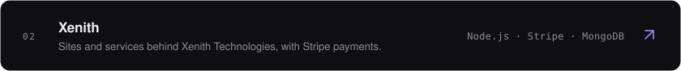</a>
  <a href="https://github.com/synoptc/xenith-bot">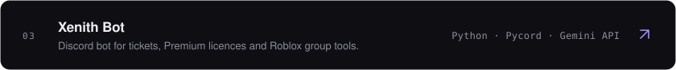</a>

  
  <a href="https://www.roblox.com/games/96796259580891/Kingdom-World">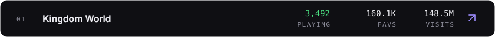</a>
  <a href="https://www.roblox.com/games/113155940464617/DRRRB-Forum"></a>
  <a href="https://www.roblox.com/games/105813536198763/Animal-Soccer"></a>
  <a href="https://www.roblox.com/games/129752340069042/Slap-or-Die"></a>

  
  

  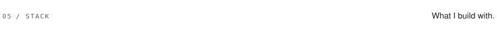
  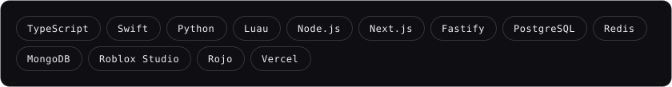

  

  <a href="https://karbon.cloud">karbon.cloud</a> ·
  <a href="https://karbon.cloud/projects">All projects</a> ·
  <a href="https://roblox.com/users/241702665/profile">Roblox</a> ·
  <a href="https://x.com/synoptc">X</a> ·
  <a href="https://instagram.com/synoptc">Instagram</a> ·
  Discord <code>synoptc</code>

Game stats refresh daily from the Roblox API.

