  

  
  
  
  
  

  
  

  
  

  

  <a href="https://karbon.cloud">karbon.cloud</a> ·
  <a href="https://karbon.cloud/projects">All projects</a> ·
  <a href="https://roblox.com/users/241702665/profile">Roblox</a> ·
  <a href="https://x.com/synoptc">X</a> ·
  <a href="https://instagram.com/synoptc">Instagram</a> ·
  Discord <code>synoptc</code>

Game stats refresh daily from the Roblox API.

